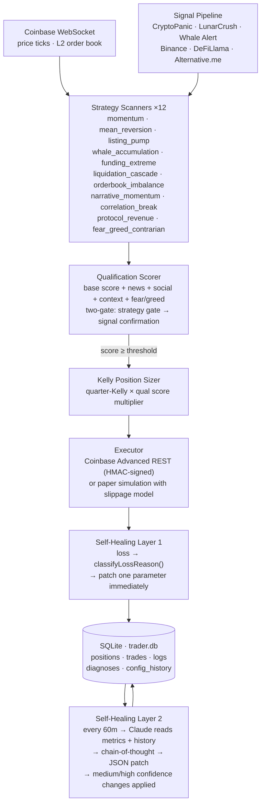

<div align="center">

# kaizen-trader

**An autonomous crypto trading engine that improves itself after every trade.**

[](https://opensource.org/licenses/MIT)
[](https://nodejs.org/)
[](https://www.typescriptlang.org/)
[](https://anthropic.com)
[](.env.example)

</div>

---

> **Disclaimer:** This is experimental software built for research purposes. Crypto trading involves significant risk of loss. The authors assume no responsibility for trading outcomes. **Always run with `PAPER_TRADING=true` first.**

---

## What it is

Most trading systems are static: they run the same rules until you manually tune them. kaizen-trader takes a different approach — it continuously analyzes its own trade history and patches its parameters in response to what the data reveals.

There are two feedback loops running in parallel:

**Loop 1 — immediate (after every loss):**
The system classifies why a trade lost and adjusts the responsible parameter before the next trade. Entered the top of a pump? Momentum threshold goes up. Stop hit in under 2 hours? Trail widens. This is a fast, targeted correction that doesn't need to see patterns across many trades to act.

**Loop 2 — periodic (every 60 minutes via Claude):**
Claude reads the full trade history, computes Sharpe/Sortino/Calmar ratios, and reasons through patterns that the rule-based healer can't detect — time-of-day effects, strategy interaction issues, signal quality drift, over-correction by the first loop. It returns a structured JSON parameter patch with confidence levels and chain-of-thought reasoning. Only medium/high confidence changes are applied.

The full audit trail — every trade, every self-healer diagnosis, every config snapshot — is written to a local SQLite database. The `CLAUDE.md` file in the repo contains instructions for Claude Code to query it and improve the strategy code directly.

---

## Architecture



---

## Strategies

### Momentum
| Strategy | Entry condition | Tier |
|---|---|---|
| `momentum_swing` | Price +2% in 1h with 2× volume spike above rolling baseline | Swing |
| `momentum_scalp` | Price +2.5% in 5m, freshness-gated: 40%+ of the move must be in the last 2m | Scalp |

### Mean reversion
| Strategy | Entry condition | Tier |
|---|---|---|
| `mean_reversion` | Price >3% from VWAP + RSI <30 (long) or >3% above VWAP + RSI >70 (short) | Swing |
| `funding_extreme` | Perp funding >0.1%/8h (over-leveraged longs) or <−0.05% (short squeeze setup) | Swing |
| `correlation_break` | Alt deviates >3% from its rolling BTC regression baseline | Swing |
| `fear_greed_contrarian` | Fear & Greed ≤15 (buy panic) or ≥85 (sell euphoria) — BTC/ETH only | Swing |

### Event-driven
| Strategy | Entry condition | Tier |
|---|---|---|
| `listing_pump` | New listing on Coinbase / Binance / Kraken / Bybit within 30m of announcement | Swing |
| `whale_accumulation` | Net whale outflow from exchanges >$5M in 2h (accumulation) or >$10M inflow (distribution) | Swing |
| `liquidation_cascade` | >$2M longs liquidated in 10m + OI falling → cascade short; exhaustion dip buy | Scalp/Swing |

### Structural
| Strategy | Entry condition | Tier |
|---|---|---|
| `orderbook_imbalance` | Bid/ask depth ratio >3× within 1% of price — scalp the wall | Scalp |
| `narrative_momentum` | Social velocity for a sector (AI, DeFi, RWA, L2…) spikes 3× → buy the sector laggard | Swing |
| `protocol_revenue` | DeFiLlama: protocol fees 2× above 7d avg, token hasn't moved yet | Swing |

---

## Signal sources

| Source | What it provides | Used by |
|---|---|---|
| **LunarCrush** | Social score + volume across Twitter/Reddit/YouTube/TikTok in one API | `narrative_momentum`, qualification scorer |
| **CryptoPanic** | News headlines with community votes, token-filtered | `mean_reversion` news gate, qualification scorer |
| **Whale Alert** | On-chain transfers >$3M, classified by wallet type | `whale_accumulation` |
| **Binance Futures** | Funding rates, open interest, real-time liquidation stream | `funding_extreme`, `liquidation_cascade` |
| **DeFiLlama** | Daily fees for 2000+ protocols | `protocol_revenue` |
| **Alternative.me** | Fear & Greed Index (updated daily, free, no auth) | `fear_greed_contrarian`, qualification scorer |
| **Coinbase Advanced** | Real-time ticks + L2 order book via WebSocket | All price-action strategies |

---

## Qualification scorer

Before any trade executes, a multi-signal scorer aggregates the strategy's base score with four independent signal sources:

```
final_score = base_strategy_score
            + news_adjustment      (-15 to +15, from CryptoPanic sentiment)
            + social_adjustment    (-12 to +12, from LunarCrush galaxy score + velocity)
            + context_adjustment   (-10 to +10, from market phase + BTC dominance)
            + fear_greed_alignment (-8  to +8,  directional agreement with trade side)
```

The independence of these signals is deliberate — they measure different dimensions of market state. A trade must clear the threshold on the *aggregated* score to proceed. This is the same two-gate pattern used in production LLM eval pipelines: the model generates a candidate, a separate scoring step confirms or rejects it.

---

## Kelly position sizing

Position sizes are computed from the Kelly Criterion applied to each strategy's historical win rate:

```
rawKelly    = (b×p − q) / b           where b = avg_win/avg_loss, p = win_rate, q = 1-p
kellySize   = rawKelly × 0.25         quarter-Kelly (reduces variance significantly)
usdSize     = kellySize × portfolioUsd × qual_score_multiplier
finalSize   = clamp(usdSize, $10, MAX_POSITION_USD)
```

Until a strategy accumulates ≥10 closed trades, it falls back to conservative 1% fixed-fractional sizing. The `scripts/performance.ts` report shows the implied Kelly fraction for each strategy.

---

## Performance metrics

The metrics engine computes institutional-grade statistics from the trade history:

```bash
npm run performance
```

```
═══════════════════════════════════════════════════
  kaizen-trader — Performance Report
  2026-04-06T09:14:22.000Z
═══════════════════════════════════════════════════

Trades:        247
Win rate:      58.3%
Profit factor: 1.74
Total P&L:     $1,842.50
Avg hold:      4.2h
Max drawdown:  12.4%
Sharpe:        1.38
Sortino:       1.91
Calmar:        3.21

By strategy:
  momentum_swing               trades= 89  win= 62%  pnl=$ 1,201  kelly=11.2%
  listing_pump                 trades= 23  win= 74%  pnl=$   892  kelly=18.4%
  narrative_momentum           trades= 31  win= 55%  pnl=$   334  kelly= 7.1%
  protocol_revenue             trades= 12  win= 67%  pnl=$   198  kelly=13.8%
  funding_extreme              trades= 18  win= 44%  pnl=$   -89  kelly= 0.0%
  momentum_scalp               trades= 74  win= 51%  pnl=$  -694  kelly= 2.1%
```

*(These are illustrative numbers from paper trading. Your results will differ.)*

---

## Self-healing loop detail

```
src/self-healing/index.ts            fires after every closed position
  └── pnlPct < -0.5%?
        ├── NO  → log win, no changes
        └── YES → classifyLossReason()
                    entered_pump_top    → raise momentumPct (+0.01)
                    stop_too_tight      → widen baseTrailPct (+0.01)
                    stop_too_wide       → tighten baseTrailPct (-0.01)
                    low_qual_score      → raise minQualScore (+2)
                    funding_squeeze     → lower fundingThreshold (-0.0001)
                    repeated_symbol     → extend cooldown
                  applyLossAdaptation() → patch live config object
                  insertDiagnosis()     → write to SQLite
                  snapshotConfig()      → record config state for audit

src/self-healing/log-analyzer.ts     fires every 60 minutes (configurable)
  └── ≥ MIN_TRADES_FOR_ANALYSIS?
        └── YES
              computeMetrics()           → Sharpe, Sortino, win rates, Kelly per strategy
              buildPrompt()              → metrics + last 100 trades + diagnosis history + error logs
              claude-opus-4-6            → chain-of-thought reasoning → JSON response
              zod validation             → reject malformed responses
              confidence filter          → skip low-confidence changes
              applyChanges()             → patch live config
              snapshotConfig()           → full audit trail
```

---

## Project structure

```
src/
├── types.ts                      All shared types — start here
├── config.ts                     Parameter defaults and hard bounds
├── index.ts                      Process entry point
│
├── strategies/                   One file per strategy (12 total)
│   ├── momentum.ts               Rolling price/volume buffers, freshness gate
│   ├── mean-reversion.ts         VWAP computation, RSI(14) from scratch
│   ├── listing-pump.ts           Multi-exchange detection, freshness scoring
│   ├── whale-tracker.ts          2h net flow window, wallet type classification
│   ├── funding-extreme.ts        OI change tracking, annualized rate display
│   ├── liquidation-cascade.ts    Cascade rider + exhaustion dip buyer
│   ├── orderbook-imbalance.ts    In-memory L2 book, bid/ask depth ratio
│   ├── narrative-momentum.ts     10 sector definitions, linear regression laggard
│   ├── correlation-break.ts      Rolling BTC/alt regression, divergence detection
│   ├── protocol-revenue.ts       DeFiLlama revenue multiple scoring
│   └── fear-greed-contrarian.ts  Extreme index plays, re-entry gate
│
├── signals/                      Real API integrations
│   ├── news.ts                   CryptoPanic — headline scoring + vote analysis
│   ├── social.ts                 LunarCrush — galaxy score, velocity detection
│   ├── whale.ts                  Whale Alert — wallet type classification, net flow
│   ├── funding.ts                Binance Futures — funding rates, OI change tracking
│   ├── fear-greed.ts             Alternative.me — index + delta1d
│   └── protocol.ts               DeFiLlama — protocol revenue spike detection
│
├── feeds/
│   └── coinbase-ws.ts            WebSocket with exponential backoff reconnection
│
├── execution/
│   ├── coinbase.ts               HMAC-SHA256 signed REST — buy/sell/balances
│   └── paper.ts                  Slippage simulation, commission model, balance tracking
│
├── risk/
│   ├── position-sizer.ts         Quarter-Kelly with qual score multiplier
│   └── portfolio.ts              Daily P&L tracking, circuit breaker, Sharpe computation
│
├── qualification/
│   └── scorer.ts                 Multi-signal aggregation, two-gate system
│
├── evaluation/
│   └── metrics.ts                Sharpe, Sortino, Calmar, profit factor, Kelly per strategy
│
├── self-healing/
│   ├── index.ts                  Rule-based: immediate loss → parameter patch
│   └── log-analyzer.ts           Claude: periodic deep analysis with chain-of-thought
│
└── storage/
    └── database.ts               SQLite — WAL mode, typed row mappers, full audit trail

scripts/
├── analyze-logs.ts               Trigger Claude analysis manually
└── performance.ts                Print metrics report (--csv flag for spreadsheet export)

docs/
└── architecture.md               System design, key decisions, data flow

CLAUDE.md                         Instructions for Claude Code to query logs and improve strategies
```

---

## Quick start

```bash
git clone https://github.com/prateekjain98/kaizen-trader
cd kaizen-trader
npm install

cp .env.example .env
# Minimum: ANTHROPIC_API_KEY + COINBASE_API_KEY/SECRET
# PAPER_TRADING=true by default

npm start
```

**Run Claude analysis manually:**
```bash
npm run analyze
```

**Print performance report:**
```bash
npm run performance

# Last 50 trades only:
npm run performance -- --last 50

# Export as CSV:
npm run performance -- --csv > trades.csv
```

**Query the database directly:**
```bash
# Win rate by strategy
sqlite3 trader.db "
  SELECT strategy,
    COUNT(*) as trades,
    ROUND(100.0 * SUM(CASE WHEN pnl_pct > 0 THEN 1 ELSE 0 END) / COUNT(*), 1) as win_pct,
    ROUND(SUM(pnl_usd), 2) as total_pnl
  FROM positions WHERE status='closed'
  GROUP BY strategy ORDER BY total_pnl DESC;"

# Recent self-healer actions
sqlite3 trader.db "
  SELECT symbol, loss_reason, action, datetime(timestamp/1000, 'unixepoch') as at
  FROM diagnoses ORDER BY timestamp DESC LIMIT 20;"
```

---

## Configuration

```bash
PAPER_TRADING=true                # always start here

# Required
ANTHROPIC_API_KEY=                # Claude log analysis
COINBASE_API_KEY=                 # price feed + execution
COINBASE_API_SECRET=

# Recommended
LUNARCRUSH_API_KEY=               # social signals (Twitter/Reddit/YouTube/TikTok)
CRYPTOPANIC_TOKEN=                # news sentiment

# Optional — enables additional strategies
BINANCE_API_KEY=                  # funding_extreme, liquidation_cascade
BINANCE_API_SECRET=
WHALE_ALERT_API_KEY=              # whale_accumulation

# Risk limits
MAX_POSITION_USD=100
MAX_DAILY_LOSS_USD=300
MAX_OPEN_POSITIONS=5

# Self-healing schedule
LOG_ANALYSIS_INTERVAL_MINS=60
MIN_TRADES_FOR_ANALYSIS=10
```

Strategies degrade gracefully when their data source isn't configured — the system runs on whatever signals are available.

---

## Adding a strategy

Every strategy is a single exported function returning `TradeSignal | null`:

```typescript
// src/strategies/my-strategy.ts
import type { TradeSignal, ScannerConfig, MarketContext } from '../types.js';
import { randomUUID } from 'crypto';

export function scanMyStrategy(
  symbol: string,
  productId: string,
  currentPrice: number,
  config: ScannerConfig,
  ctx: MarketContext,
): TradeSignal | null {

  // Return null if conditions not met
  if (ctx.fearGreedIndex > 30) return null;

  return {
    id: randomUUID(),
    symbol,
    productId,
    strategy: 'my_strategy',  // add this to StrategyId in types.ts
    side: 'long',
    tier: 'swing',
    score: 72,
    confidence: 'medium',
    sources: ['fear_greed'],
    reasoning: `${symbol} in extreme fear — contrarian entry`,
    entryPrice: currentPrice,
    stopPrice: currentPrice * 0.95,
    suggestedSizeUsd: 100,
    expiresAt: Date.now() + 3_600_000,
    createdAt: Date.now(),
  };
}
```

Then:
1. Add `'my_strategy'` to the `StrategyId` union in `src/types.ts`
2. Export from `src/strategies/index.ts`

The self-healing engine will automatically begin tracking its win rate and adjusting parameters after it accumulates 10+ trades.

---

## Requirements

- Node.js 20+
- SQLite (via `better-sqlite3` — no separate install needed)
- Coinbase Advanced Trade account
- Anthropic API key (for self-healing)

---

## Contributing

1. Fork and create a branch
2. Add a strategy in `src/strategies/` following the pattern above
3. Add tests in `src/strategies/__tests__/` verifying signal conditions
4. Open a PR with a description of the edge being captured and the entry/exit logic

---

## License

MIT
