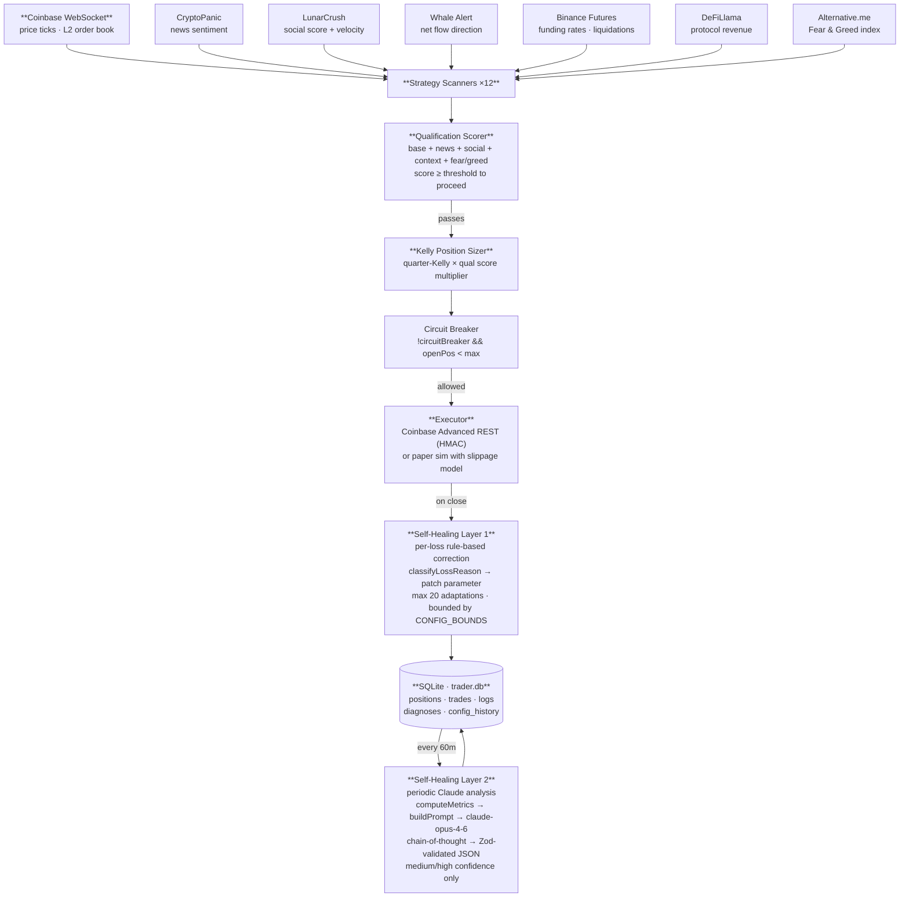
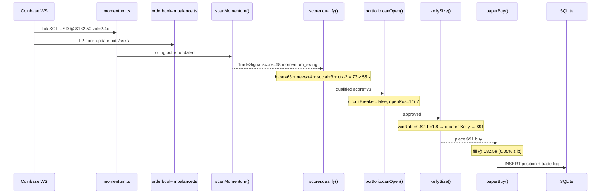

# Architecture

## System overview

## Key design decisions

### Why two self-healing layers?

The rule-based healer (Layer 1) is fast and local — it fires immediately after every loss and patches one parameter. Think of it as a PID controller: it corrects the most recent error without seeing the broader pattern.

Claude (Layer 2) solves a different problem: patterns that only become visible across many trades. "Momentum scalp consistently loses on Monday mornings" or "funding_extreme trades placed during extreme greed underperform even when the signal is strong" — these require reasoning over a longer window than a rule-based system can handle efficiently.

Using both is the same principle as having automated tests plus a code reviewer: fast automated feedback for obvious issues, periodic deep review for structural problems.

### Why chain-of-thought prompting?

Early versions asked Claude directly for a parameter patch and got overconfident changes with thin reasoning. Adding chain-of-thought (asking Claude to reason before producing the JSON) improved patch quality significantly:

- Forces articulation of the evidence before the recommendation
- Catches logical gaps (a strategy with 3 losses isn't statistically significant)
- Produces audit-able reasoning stored in the `data` field of the heal log

### Why Zod schema validation on the Claude response?

LLM output is non-deterministic. A Zod schema gives us:
1. Type safety — the rest of the codebase can trust the shapes
2. Rejection of malformed responses with clear error messages
3. A spec for what we expect (if Claude drifts, we see it immediately)

### Why SQLite and not a hosted database?

The full audit trail (every trade, every diagnosis, every config snapshot) needs to be queryable by Claude Code locally. SQLite is zero-infrastructure, ships as an npm package, and the `analyze-logs.ts` script can query it directly without a network call. The `CLAUDE.md` instructions use raw `sqlite3` CLI commands that work on any machine.

### Why Kelly criterion for position sizing?

Fixed position sizing (e.g., always $100) is common but ignores strategy quality. A strategy with a 70% win rate and 2:1 win/loss ratio should get more capital than one with a 45% win rate and 1:1 ratio.

Quarter-Kelly specifically is used instead of full Kelly because:
- Full Kelly requires precise win rate estimation, which requires large sample sizes
- Quarter-Kelly gives similar long-term growth with significantly lower variance
- At small trade counts, it's effectively equivalent to conservative fixed-fractional

See `src/risk/position-sizer.ts` for the full implementation.

## Signal pipeline

The qualification scorer aggregates five independent signal sources to avoid over-reliance on any single signal:

| Source | Weight | Notes |
|---|---|---|
| Strategy score | 50% | From the strategy scanner itself |
| News sentiment | 15% | CryptoPanic headline + vote analysis |
| Social momentum | 15% | LunarCrush galaxy score + velocity |
| Market context | 10% | Phase (bull/bear/neutral), BTC dominance |
| Fear & Greed alignment | 10% | Directional agreement with trade side |

The independence of these signals is important. News sentiment and social momentum can be correlated (the same event drives both), but they're different enough to be worth separate weight. Market context and Fear & Greed are macro signals that are largely uncorrelated with token-specific price action.

## Data flow on a single tick

