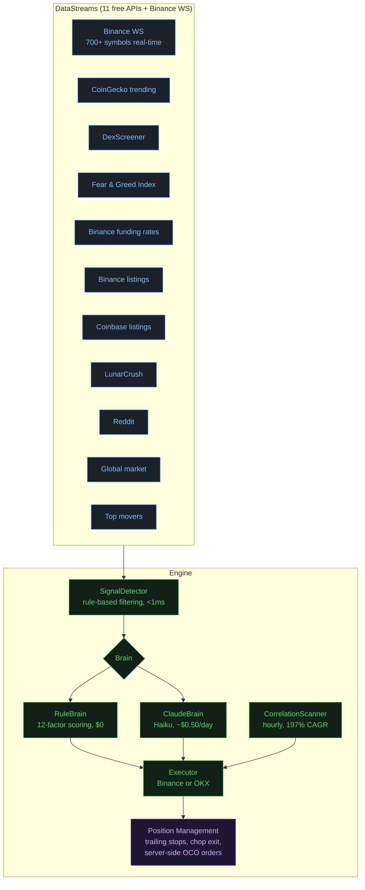
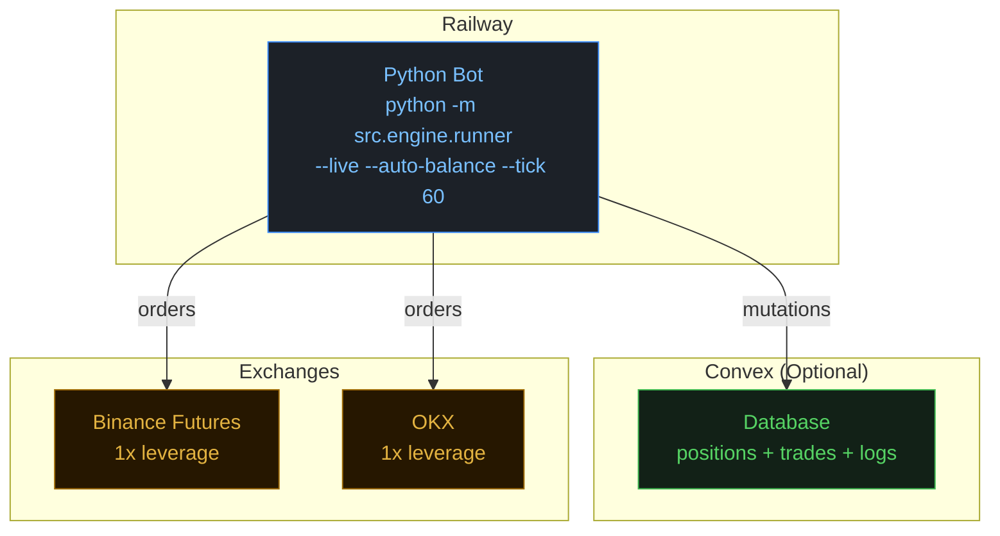

# Architecture

## System overview

The system has two entry points:

| Entry point | Purpose |
|---|---|
| `python -m src.engine.runner` | **Primary** -- live trading engine |
| `python -m src.main` | Legacy self-healing loop (backtesting, parameter tuning) |

### Live engine pipeline

## Key components

### DataStreams (`src/engine/data_streams.py`)

11 free API sources:

| Source | Data |
|---|---|
| Binance WS | 700+ symbols real-time price/volume |
| CoinGecko | Trending tokens |
| DexScreener | DEX activity |
| Fear & Greed Index | Market sentiment (0-100) |
| Binance funding rates | Perpetual futures funding |
| Binance listings | New token listings |
| Coinbase listings | New token listings |
| LunarCrush | Social momentum |
| Reddit | Community sentiment |
| Global market | Total market cap, BTC dominance |
| Top movers | Biggest gainers/losers |

### SignalDetector (`src/engine/signal_detector.py`)

Rule-based signal filtering. Processes these event types:
- `listing_pump` -- new exchange listings
- `funding_extreme` -- abnormal funding rates
- `fgi_extreme` -- Fear & Greed extremes
- `trending` -- social/search trending
- `major_pump` -- large sudden moves
- `large_move` -- significant price action

### RuleBrain (`src/engine/rule_brain.py`)

12-factor scoring system. Zero API cost.

| Factor | Points |
|---|---|
| Funding squeeze | +40 |
| 1h acceleration | +30 / +50 |
| Correlation break | +20 |
| Late-pump penalty | -15 to -40 |

### ClaudeBrain (`src/engine/claude_brain.py`)

Claude Haiku API calls every 60s. Approximately $0.50/day.

### CorrelationScanner (`src/engine/correlation_scanner.py`)

BTC-alt divergence detection, runs hourly. 57% win rate, 197% CAGR backtested.

### Executor (`src/engine/executor.py`)

Position lifecycle: open, trailing stop, chop exit (>60min <2% movement), server-side OCO orders, commission tracking.

### Providers (`src/execution/providers.py`)

BinanceProvider and OKXProvider. 1x leverage, step size caching, fill polling.

## Trading strategies that work (live results)

| Strategy | Description | Notable results |
|---|---|---|
| **Funding squeeze** | Extremely negative funding + price acceleration | ENJ +26%, MBOX +25% |
| **Correlation break** | Alts underperforming BTC by >1.5% on 4h | 57% WR, 197% CAGR |
| **Listing pump** | New exchange listings | 77% WR (Coinbase) |
| **FGI contrarian** | BTC buys at extreme fear (<15) | -- |

## Risk management

- **1x leverage always**
- Strategy-specific stops: -8% to -12%
- Chop exit after 60min of <2% movement
- Trailing stops activate at 1.5x stop distance profit
- Max 4 positions, max $20/position
- Server-side stops survive process crashes

## Deployment architecture

