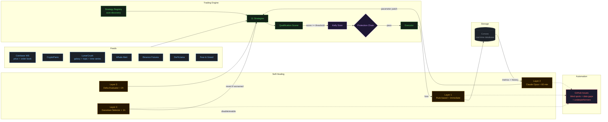
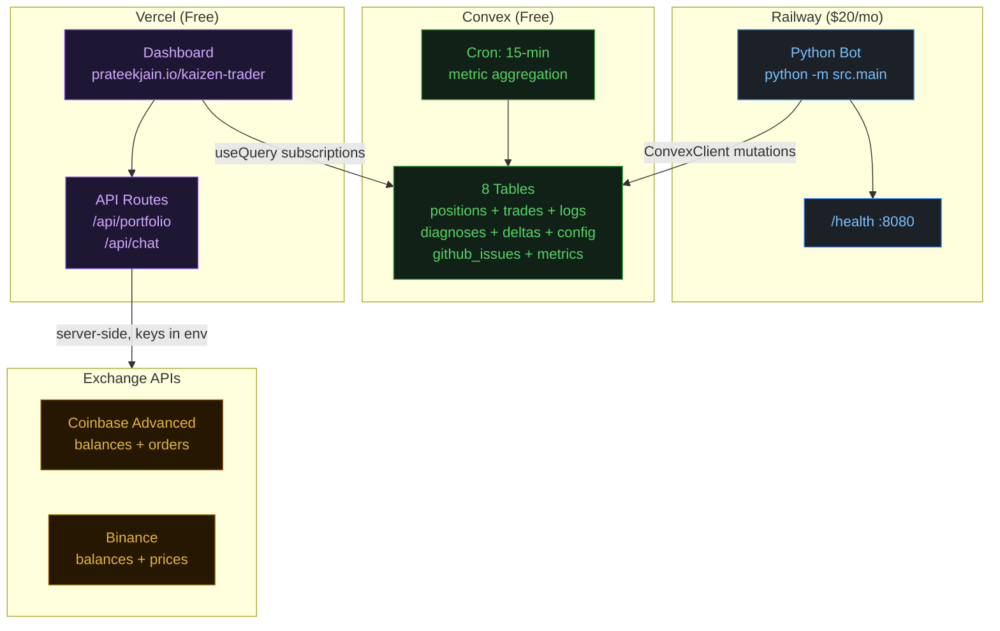
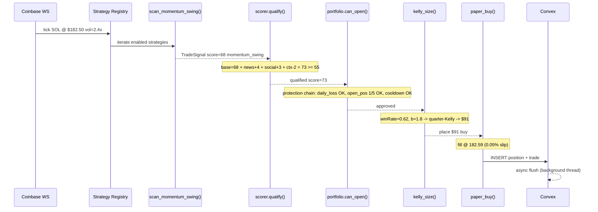

# Architecture

## System overview



## Deployment architecture



## Key design decisions

### Why four self-healing layers?

| Layer | Speed | Scope | What it catches |
|---|---|---|---|
| **L1 — Rule-based healer** | Immediate | Single trade | Obvious causes: pump top entry, tight stop, low qual score |
| **L2 — Claude analysis** | 60 min | All recent trades | Patterns across trades: time-of-day effects, strategy interactions, signal drift |
| **L3 — Delta evaluator** | 2 hours | Parameter changes | Whether L1/L2 changes actually improved or worsened performance |
| **L4 — Strategy selector** | 1 hour | Strategy-level | Which strategies are net positive vs chronic underperformers |

L1 is a PID controller (fast, local correction). L2 is a code reviewer (deep periodic analysis). L3 is an A/B test framework (did the change help?). L4 is natural selection (kill what doesn't work).

### Why delta tracking?

Without it, the self-healer can enter oscillation loops — L1 raises a threshold after one loss, then L2 lowers it because the sample is too small, then L1 raises it again. Delta tracking breaks the loop: if a change worsened the next 10 trades, it gets auto-reverted regardless of which layer made it.

Each delta records: parameter name, old/new value, reason, source (healer/claude), and a snapshot of the last 20 trades' win_rate + avg_pnl. After 10+ post-change trades, the evaluator compares before/after. Worsened = win_rate dropped >5% OR avg_pnl dropped >10%.

### Why declarative protection chain?

Previous architecture had a single `circuit_breaker_open()` boolean. The protection chain replaces this with composable rules:

```python
DEFAULT_PROTECTIONS = [
    {"name": "daily_loss_limit", "params": {"max_loss_usd": 300}},
    {"name": "max_open_positions", "params": {"max_positions": 5}},
    {"name": "cooldown_after_loss", "params": {"cooldown_s": 60}},
]
```

Each protection implements `can_open(ctx) -> Verdict`. The chain short-circuits on the first block. This makes it trivial to add new protections (e.g., max drawdown, volatility pause) without touching the portfolio manager.

### Why auto-discovery strategy registry?

Strategies are discovered at startup by scanning `src/strategies/` for `scan_*` / `on_*` functions. No manual registration needed. This means:

1. Drop a new `.py` file → it's live on next restart
2. `STRATEGY_META` dict for richer metadata (optional)
3. Duplicate strategy ID detection (raises `ValueError`)
4. Thread-safe lazy initialization with double-checked locking

### Why Convex (not Postgres or SQLite)?

**Convex** is the sole database because:
- Native real-time subscriptions — dashboard gets live updates via `useQuery`, no polling
- Free tier (16M fn calls/mo, 1GB storage) covers this use case
- Native cron jobs for metric aggregation
- Python SDK client with async background flush queue (writes don't block the tick-processing hot path)
- Schema enforcement and indexes defined in TypeScript (`convex/schema.ts`)

Writes are queued in-process and flushed every 1 second via a background thread. Reads are synchronous blocking calls to Convex queries.

### Why chain-of-thought prompting for Claude?

Early versions asked Claude directly for a parameter patch and got overconfident changes with thin reasoning. Chain-of-thought:
- Forces articulation of evidence before the recommendation
- Catches logical gaps (3 losses isn't statistically significant)
- Produces audit-able reasoning stored in the log
- Now also includes delta evaluation context and blind spot data

### Why circuit breakers on signal fetchers?

Each of the 6 external APIs (CryptoPanic, LunarCrush, Whale Alert, Binance Futures, DeFiLlama, Alternative.me) has an independent circuit breaker:

- **Closed** (normal): requests pass through
- **Open** (after 3 failures): all requests short-circuit for 5 minutes
- **Half-open**: one probe request allowed; success → closed, failure → open again

Without this, a broken API hammers the endpoint with retries, wastes rate limits, and can cascade into slow tick processing.

### Why quarter-Kelly for position sizing?

Full Kelly requires precise win rate estimation (large sample sizes). Quarter-Kelly gives similar long-term growth with significantly lower variance. At small trade counts (<10), it falls back to conservative 1% fixed-fractional sizing.

## Signal pipeline

The qualification scorer aggregates five independent signal sources:

| Source | Range | Notes |
|---|---|---|
| Strategy score | base score | From the strategy scanner itself |
| News sentiment | -15 to +15 | CryptoPanic headline + vote analysis |
| Social momentum | -12 to +12 | LunarCrush galaxy score, velocity, AltRank, sentiment breakdown |
| Market context | -10 to +10 | Phase (bull/bear/neutral), BTC dominance |
| Fear & Greed | -8 to +8 | Directional agreement with trade side |

Social scoring enhancements (LunarCrush subscription):
- Galaxy score >60: +5 / <30: -5
- Velocity >30: +3 / >50: +7
- AltRank improving >20 positions: +4 / declining >20: -3
- Negative sentiment >70%: -5 (longs only)
- Social volume 24h doubling: +3 / halving: -2
- Topic sentiment via `/topic/:topic` endpoint
- Time series via `/topic/:topic/time-series/v2` for acceleration detection

## Data flow on a single tick



## Thread architecture

The bot runs as a single process with multiple daemon threads:

```
Main thread
├── CoinbaseWebSocket thread (price ticks + L2 book)
├── Exit checker thread (every 5s — trailing stops, max hold)
├── Market context refresh thread (every 2min — fear/greed)
├── Signal refresh thread (every 3min — news, social, funding, whale, protocol)
├── Self-healing analysis thread (every 60min — Claude)
├── Strategy evaluation thread (every 1h — darwinian selector + delta evaluator)
├── Health check HTTP server thread (port 8080)
└── Thread health monitor (every 30s — detect and restart dead threads)
```

All threads coordinate via:
- `threading.Event` for graceful shutdown
- `threading.Lock` / `RLock` on all shared mutable state
- `queue.Queue` for Convex background flush

## Storage schema

```sql
positions     -- id, symbol, product_id, strategy, side, tier, entry_price, quantity,
              -- size_usd, opened_at, high/low_watermark, current_price, trail_pct,
              -- stop_price, max_hold_ms, qual_score, signal_id, status,
              -- exit_price, closed_at, pnl_usd, pnl_pct, exit_reason, paper_trading

trades        -- id, position_id, side, symbol, quantity, size_usd, price,
              -- order_id, status, error, paper_trading, placed_at

logs          -- id, level, message, symbol, strategy, data (JSON), ts

diagnoses     -- id, position_id, symbol, strategy, pnl_pct, hold_ms,
              -- exit_reason, loss_reason, entry_qual_score, market_phase_at_entry,
              -- action, parameter_changes (JSON), timestamp

scanner_config_history  -- id, config (JSON), reason, timestamp
```

Indexes on: `positions(status)`, `positions(symbol)`, `trades(position_id)`, `logs(ts)`, `logs(level)`, `logs(symbol)`.

## GitHub automation

Three types of auto-created issues:

| Trigger | Label | Condition |
|---|---|---|
| **Blind spot** | `blind-spot` | Same unknown loss fingerprint appears 3+ times |
| **Data gap** | `data-gap` | Claude analysis suggests a new data source |
| **Chronic underperformer** | `chronic-underperformer` | Strategy disabled >14 days |

Dedup: checks `_created_issues` dict before creating. Daily cap: 3 issues/day. Uses `gh` CLI subprocess.
